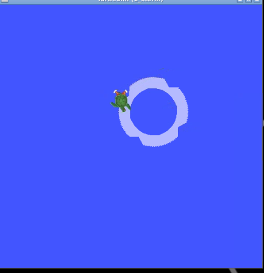
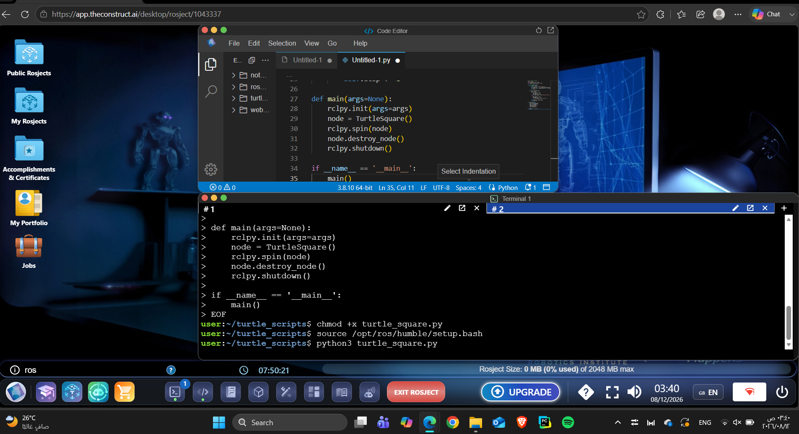
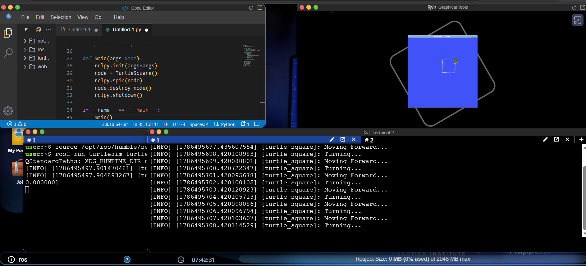
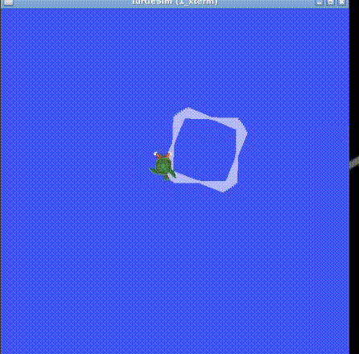

# ROS 2 TurtleSim Square Motion Controller 🐢🤖

> A practical ROS 2 robotics project that demonstrates simulated robot motion control using Python, ROS 2 publishers, timed callbacks, and `geometry_msgs/Twist` velocity commands.



---

## 📌 Overview

**ROS 2 TurtleSim Square Motion Controller** is a hands-on robotics project developed using **ROS 2 Humble**, **Python**, and **TurtleSim**.

The project demonstrates how a Python-based ROS 2 node can communicate with a simulated robot by publishing velocity commands to the `/turtle1/cmd_vel` topic.

The controller alternates between forward movement and rotation, producing a repeated square-like motion pattern inside the TurtleSim environment.

The project focuses on understanding the fundamental connection between **Python programming, ROS 2 communication, publishers, topics, timers, callbacks, and robotic motion control**.

---

## 🎯 Project Objectives

The main objectives of this project were to:

- Build a ROS 2 node using Python.
- Understand the basic ROS 2 node architecture.
- Create and use a ROS 2 publisher.
- Publish `geometry_msgs/Twist` messages.
- Control linear and angular velocity.
- Use ROS 2 timers and callbacks.
- Communicate through the `/turtle1/cmd_vel` topic.
- Control a simulated robot using TurtleSim.
- Practice running ROS 2 applications from a Linux terminal.
- Connect programming logic with robotic movement.

---

## 🧠 How It Works

The project follows a simple ROS 2 communication flow:

```text
                 Python Program
                       │
                       ▼
                 ROS 2 Node
                 "turtle_square"
                       │
                       ▼
                Timer Callback
                       │
              ┌────────┴────────┐
              │                 │
              ▼                 ▼
        Move Forward           Turn
        linear.x = 2.0     angular.z = 1.57
              │                 │
              └────────┬────────┘
                       ▼
               /turtle1/cmd_vel
                       │
                       ▼
                   TurtleSim
                       │
                       ▼
                Simulated Motion
```

The node publishes a new `Twist` message every second.

The controller uses a simple step counter to alternate between forward movement and rotation.

---

## ⚙️ Motion Control

### Forward Movement

When the current step is even, the turtle receives:

```python
msg.linear.x = 2.0
msg.angular.z = 0.0
```

This commands the turtle to move forward without rotating.

---

### Rotation

When the current step is odd, the turtle receives:

```python
msg.linear.x = 0.0
msg.angular.z = 1.57
```

This stops the forward movement and rotates the turtle.

The angular velocity of `1.57 rad/s` is approximately equivalent to a 90-degree-per-second rotation.

---

## 🛠️ Technologies Used

| Technology | Purpose |
|---|---|
| **ROS 2 Humble** | Robotics middleware and communication |
| **Python 3** | Motion-control programming |
| **rclpy** | ROS 2 Python client library |
| **TurtleSim** | Robot simulation environment |
| **geometry_msgs/Twist** | Velocity command message |
| **Linux Terminal** | Development and execution environment |

---

## 📂 Project Structure

The project files are stored directly in the repository:

```text
ROS2-TurtleSim-Square-Motion-Controller/
│
├── README.md
├── turtle_square.py
│
├── 01-development-environment.png
├── 02-ros2-process.png
├── 03-final-output.png
├── final-process.gif
└── ros2-final-process.mp4
```

---

## 💻 Source Code

The main ROS 2 controller is implemented in `turtle_square.py`.

```python
#!/usr/bin/env python3

import rclpy
from rclpy.node import Node
from geometry_msgs.msg import Twist


class TurtleSquare(Node):

    def __init__(self):
        super().__init__('turtle_square')

        self.publisher_ = self.create_publisher(
            Twist,
            '/turtle1/cmd_vel',
            10
        )

        self.timer = self.create_timer(
            1.0,
            self.timer_callback
        )

        self.step = 0

    def timer_callback(self):
        msg = Twist()

        if self.step % 2 == 0:
            msg.linear.x = 2.0
            msg.angular.z = 0.0
            self.get_logger().info('Moving Forward...')

        else:
            msg.linear.x = 0.0
            msg.angular.z = 1.57
            self.get_logger().info('Turning...')

        self.publisher_.publish(msg)
        self.step += 1


def main(args=None):
    rclpy.init(args=args)

    node = TurtleSquare()

    rclpy.spin(node)

    node.destroy_node()
    rclpy.shutdown()


if __name__ == '__main__':
    main()
```

---

## 🚀 How to Run

### 1. Source ROS 2 Humble

Open a terminal and run:

```bash
source /opt/ros/humble/setup.bash
```

---

### 2. Start TurtleSim

Run:

```bash
ros2 run turtlesim turtlesim_node
```

This launches the TurtleSim simulation environment.

---

### 3. Navigate to the Script Directory

```bash
cd ~/turtle_scripts
```

---

### 4. Source ROS 2 Again

```bash
source /opt/ros/humble/setup.bash
```

---

### 5. Make the Python Script Executable

```bash
chmod +x turtle_square.py
```

---

### 6. Run the Controller

```bash
python3 turtle_square.py
```

The terminal will display messages such as:

```text
[turtle_square]: Moving Forward...
[turtle_square]: Turning...
[turtle_square]: Moving Forward...
[turtle_square]: Turning...
```

At the same time, TurtleSim receives the velocity commands and moves according to the programmed logic.

---

## 🖥️ Development Environment

The project was developed in a Linux-based ROS 2 environment using Python and ROS 2 Humble.



---

## 🔄 ROS 2 Execution Process

The following image shows the ROS 2 execution process, including the TurtleSim environment and the Python controller running through the terminal.



---

## 🎯 Final Output

The final simulation demonstrates the resulting TurtleSim movement produced by the Python ROS 2 controller.


---

## 🎥 Final Demonstration

The animated GIF below provides a quick visual demonstration of the final ROS 2 TurtleSim process.



### Full Video

For the complete demonstration, see:

**[▶ View the Full ROS 2 TurtleSim Demonstration](ros2-final-process.mp4)**

> The GIF is included for quick viewing directly inside the GitHub README, while the original MP4 is provided as the complete demonstration.

---

## 🔍 ROS 2 Concepts Demonstrated

### 1. ROS 2 Node

The project creates a custom ROS 2 node:

```python
class TurtleSquare(Node):
```

The node is responsible for generating and publishing the robot's movement commands.

---

### 2. Publisher

The controller creates a publisher using:

```python
self.publisher_ = self.create_publisher(
    Twist,
    '/turtle1/cmd_vel',
    10
)
```

This allows the Python node to send velocity commands to TurtleSim.

---

### 3. ROS 2 Topic

The main communication topic used by the project is:

```text
/turtle1/cmd_vel
```

This topic carries the velocity commands that control the simulated turtle.

---

### 4. Twist Message

The project uses:

```python
from geometry_msgs.msg import Twist
```

The `Twist` message contains linear and angular velocity components.

The project primarily uses:

```python
linear.x
```

for forward movement and:

```python
angular.z
```

for rotation.

---

### 5. Timer Callback

The controller uses a ROS 2 timer:

```python
self.timer = self.create_timer(
    1.0,
    self.timer_callback
)
```

This causes the callback function to execute once every second.

The callback then determines whether the turtle should move forward or rotate.

---

## 🔁 Motion Logic

The movement logic is based on the `step` counter:

```python
if self.step % 2 == 0:
```

This creates the following sequence:

```text
Step 0 → Move Forward
Step 1 → Turn
Step 2 → Move Forward
Step 3 → Turn
Step 4 → Move Forward
Step 5 → Turn
...
```

This simple control structure demonstrates how programmed states can be used to create robot movement patterns.

---

## 📊 Key Parameters

| Parameter | Value | Description |
|---|---:|---|
| Timer period | `1.0 s` | Time between callback executions |
| Linear velocity | `2.0` | Forward movement speed |
| Angular velocity | `1.57 rad/s` | Rotation speed |
| Topic | `/turtle1/cmd_vel` | Turtle velocity command topic |
| Message | `Twist` | ROS 2 velocity message |
| Node | `turtle_square` | Main controller node |

---

## 🧩 Project Architecture

The project demonstrates a basic publisher-based ROS 2 architecture:

```text
┌──────────────────────────────┐
│       turtle_square.py       │
│                              │
│       ROS 2 Python Node      │
└──────────────┬───────────────┘
               │
               │ Publish Twist
               ▼
┌──────────────────────────────┐
│      /turtle1/cmd_vel        │
│          ROS 2 Topic         │
└──────────────┬───────────────┘
               │
               ▼
┌──────────────────────────────┐
│          TurtleSim           │
│      Simulated Robot         │
└──────────────────────────────┘
```

---

## 📈 Possible Improvements

The current implementation focuses on the fundamentals of ROS 2 communication and simulated robot motion.

Possible future improvements include:

- Implementing a dedicated state machine for the four sides of the square.
- Automatically stopping after one complete square.
- Adding configurable square dimensions.
- Adding ROS 2 parameters for movement speed.
- Using elapsed time to control movement distance more accurately.
- Subscribing to `/turtle1/pose` for feedback.
- Implementing closed-loop motion control.
- Adding ROS 2 services to start and stop the controller.
- Creating a complete ROS 2 Python package.
- Adding a ROS 2 launch file.
- Adding automated tests.
- Separating configuration from the main control logic.

These improvements would make the controller more precise and move it closer to a robust robotics control architecture.

---

## 📚 What I Learned

This project provided practical experience with the connection between software and robotics:

```text
Python
   ↓
ROS 2 Node
   ↓
Publisher
   ↓
Twist Message
   ↓
ROS 2 Topic
   ↓
TurtleSim
   ↓
Robot Motion
```

Through the project, I practiced:

- ROS 2 node creation
- Publishers
- Topics
- `Twist` messages
- Timers
- Callback functions
- Velocity control
- Linux-based ROS 2 execution
- Robot simulation

---

## 🏁 Conclusion

**ROS 2 TurtleSim Square Motion Controller** is a practical robotics project demonstrating how Python can be integrated with ROS 2 to control a simulated robot.

The project starts with fundamental ROS 2 communication concepts and connects them to an observable robotic behavior inside TurtleSim.

This provides a foundation for progressing toward more advanced robotics topics such as:

- Sensor integration
- Odometry
- Localization
- Feedback control
- Autonomous navigation
- ROS 2 services and actions
- Real robotic platforms

---

## 👤 Author

**Anas Sami Al-Harthi**

---

## ⭐ Project Summary

**ROS 2 TurtleSim Square Motion Controller** demonstrates the practical use of **Python, ROS 2, TurtleSim, publishers, topics, timers, callbacks, and `Twist` velocity messages** to control simulated robot movement.

It is a compact project focused on building practical ROS 2 and robotics programming experience.

---
